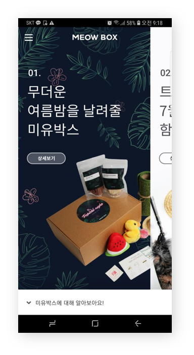

# MeowBox - Android


반려묘를 위한 수제 필수용품과 간식을 정기 배송하는 서비스 **MeowBox** 입니다.
**SOPT 22기 AppJam 대상 수상**
개발 기간 : 2018년 7월 1일 ~ 7월 14일

## [ About ]

필수 용품(장난감, 스크래쳐 등등)과 수제 간식과 같은 반려묘에게 꼭 필요한 것들을 정기 배송 해줌으로써 묘주의 구매력을 높이고 새로운 아이템을 찾아야 하는 번거로움을 해결하였고, 수제 간식 같은 건강식을 통해 반려묘의 건강을 관리 할 수 있습니다. 

매달 **컨셉**이 담긴 박스입니다.
반려묘를 키우는 사람을 대상으로 맞춤형 박스를 제공합니다.
1. 초보자 박스
2. 월별 컨셉 박스
3. 생일 박스

## [ Main View, Function ]


* 메인 화면
	* 로그인 및 회원가입을 하지 않아도 앱을 둘러보고 사용할 수 있습니다.
	* 주문하기와 마이 페이지는 로그인이 필요합니다.
	* **Navigation Bar**를 이용하여 사용자가 어디서든 다른 화면으로 이동할 수 있도록 접근성을 높였습니다.
	* **onPageScrolled**() 함수의 position과 **positionOffset**값을 이용하여 Viewpager에 들어가는 item의 **Padding** 값을 조절하여 카드 형식으로 화면을 넘겨 볼 수 있도록 구성하였습니다. 

```kotlin
    main_viewpager.addOnPageChangeListener(object : ViewPager.OnPageChangeListener{
            override fun onPageScrollStateChanged(state: Int) {

            }
	    
            override fun onPageSelected(position: Int) {
           

            }
	    // position과 positionOffset을 조절
            override fun onPageScrolled(position: Int, positionOffset: Float, positionOffsetPixels: Int) {
                when(position){
                    (items.size-2)->{
                        main_viewpager.setPadding((200 * positionOffset).toInt(),0,200 - (200*positionOffset).toInt(),0)
                    }
                    (items.size-1)->{
                        main_viewpager.setPadding(200,0,0,0)
                    }
                }
            }
        })
```



* 미유 박스 이야기 화면
	* 미유 박스의 목표와 미유 박스가 무엇인지, 미유 박스는 어떤 구성품으로 구성되어있는지를 설명해줍니다.
	* 그리고 미유 박스를 주문할 수 있도록 유도합니다. 

* 생일 축하해 화면
	* 반려묘의 생일을 축하하는 이야기가 담겨 있는 화면입니다.
	* 자체 제작한 웹툰이 연재되어 있습니다. 

* 테스트 결제 기능
	* IamPort 모듈을 이용해서 테스트 결제 기능을 구현했습니다.
	* PG사와 카드사가 제공하는 인증 및 프로세스는 웹을 통해서 이루어지므로 Webview를 활용하였습니다.
	* 내장된 Webview에서 아임포트 Javascript 코드가 포함된 페이지를 로드하며 이를 기반으로 결제가 이루어지게 됩니다. 
	* WebView와 통신하기 위해 JavaScript로 함수를 구성해 통신을 진행하였습니다.


## [ Develop Environment ]

* Language - **Kotlin**, java
* Minimum SDK Version - 21
* Target SDK Version - 27
* Optimization Device - **Galaxy s8+**


## [ Library ]

1. **Layout**
* [slidinguppanel](https://github.com/umano/AndroidSlidingUpPanel)
* [circleimageview](https://github.com/hdodenhof/CircleImageView)
* [recyclerView](https://developer.android.com/guide/topics/ui/layout/recyclerview)
* [expandablerecyclerview](https://github.com/thoughtbot/expandable-recycler-view)

2. **HTTP REST API**
* [retrofit2](https://github.com/square/retrofit)
* [gson](https://github.com/google/gson)

3. **Animation**
* [lottie](https://github.com/airbnb/lottie-android)


## [ 워크 플로우 ]


